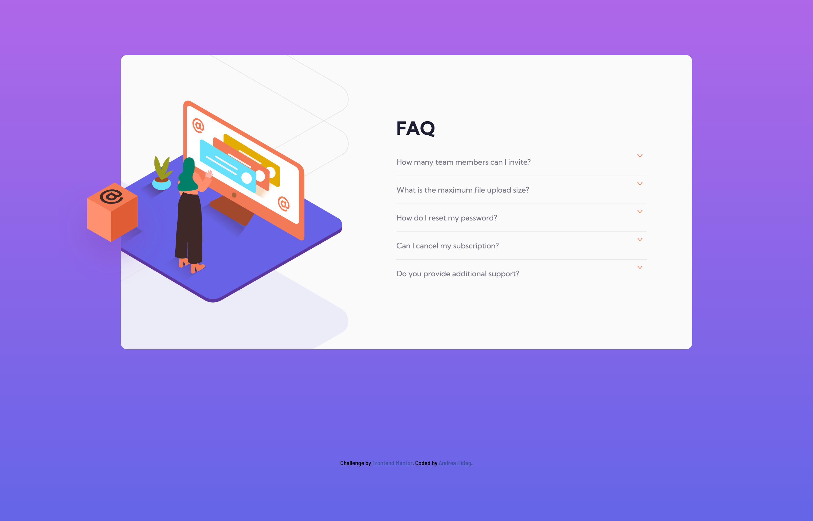
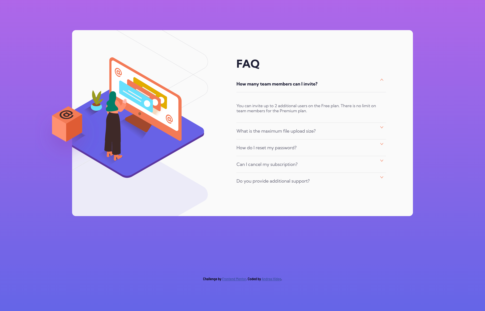
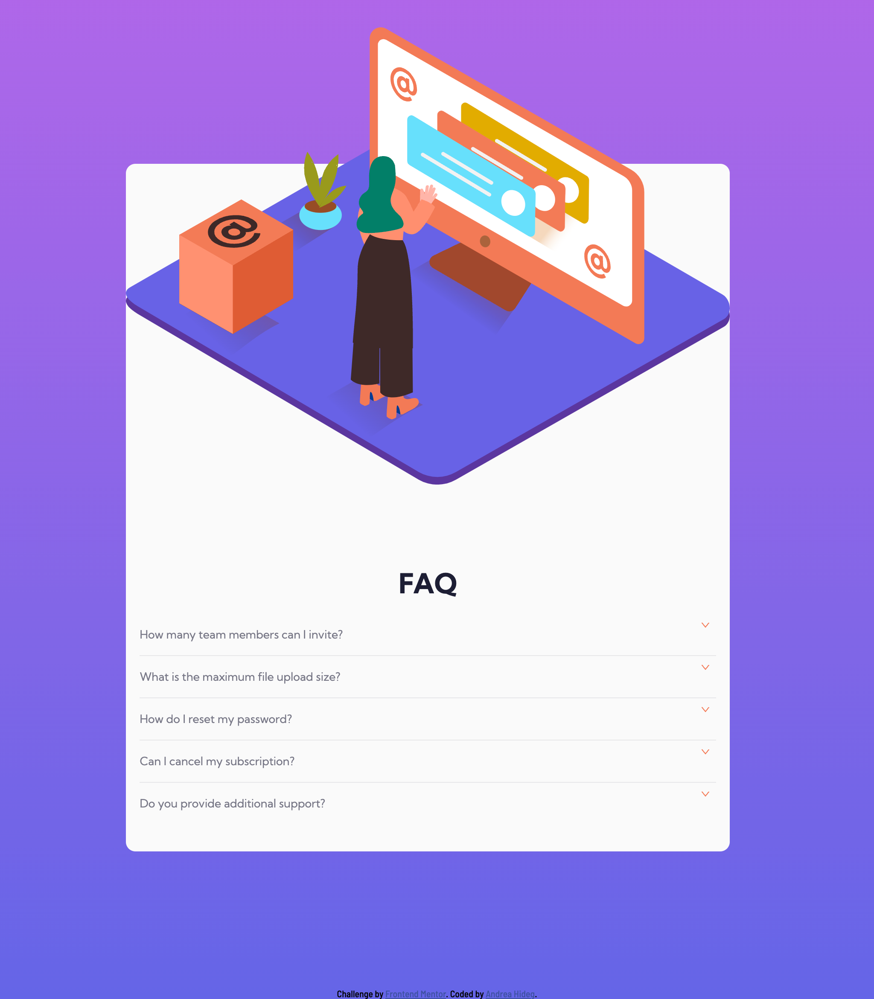
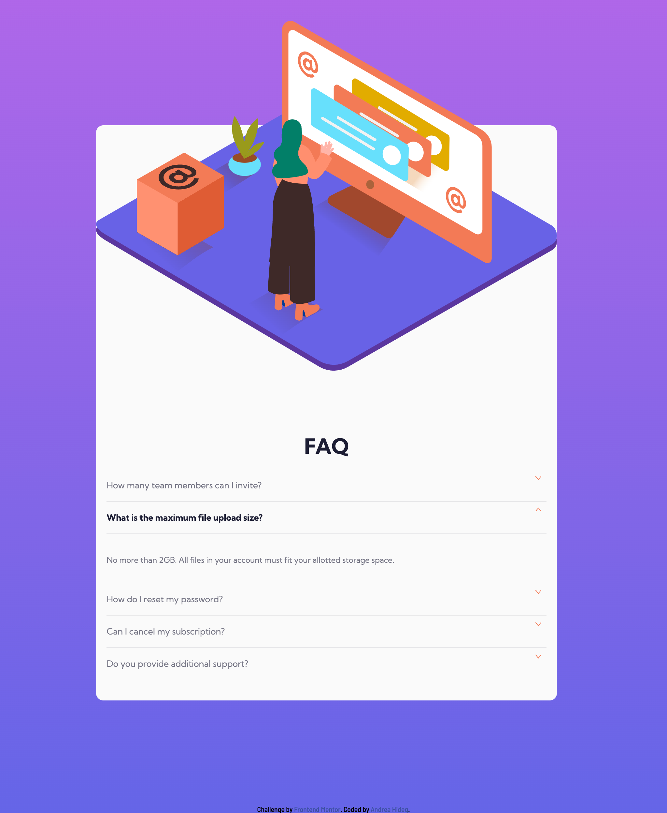

# Frontend Mentor - FAQ accordion card solution

This is a solution to the [FAQ accordion card challenge on Frontend Mentor](https://www.frontendmentor.io/challenges/faq-accordion-card-XlyjD0Oam). Frontend Mentor challenges help you improve your coding skills by building realistic projects. 

## Table of contents

- [Overview](#overview)
  - [The challenge](#the-challenge)
  - [Screenshot](#screenshot)
  - [Links](#links)
- [My process](#my-process)
  - [Built with](#built-with)
  - [What I learned](#what-i-learned)
  - [Continued development](#continued-development)
  - [Useful resources](#useful-resources)
- [Author](#author)
- [Acknowledgments](#acknowledgments)


## Overview

### The challenge

Users should be able to:

- View the optimal layout for the component depending on their device's screen size
- See hover states for all interactive elements on the page
- Hide/Show the answer to a question when the question is clicked

### Screenshots








### Links

- Solution URL: [Add solution URL here] ()
- Live Site URL: [Add live site URL here](https://mirmurr.github.io/FAQ-section/)

## My process

### Built with

- Semantic HTML5 markup
- CSS custom properties
- Flexbox
- Mobile-first workflow
- JS
- [Icons](https://atomicons.com/) - For icons
- codefoxx Youtube channel, video: (https://www.youtube.com/watch?v=nibpBY76HUw) - This resource helped me a lot to complete this project. I followed the steps in the video to build the HTML file and style the page with CSS and JS. I used the JS code from the video and adapted it to this project. 


### What I learned

- positioning of the background image

- refreshed my knowledge on image positioning - setting the image´s position to absolute, removes the image from the document flow and we can position it so that it overlaps another image

- JS function to hide and show elements, importance of max-height: 0 and overflow: hidden properties in CSS

- easier formatting with JS + CSS combined (example code below)


### EXAMPLE CODES:
_________________________________________________________________________________________________________________
- With this trick the answers can be hidden:

```css
.answer {
    max-height: 0;
    overflow: hidden; /*max height 0 and overflow hidden hides the content*/
    transform: translate(0px);                         /*we can set it to x px but then when the text appears it will slide to right by x px, by default it´s 0, so I deleted this line from my code.*/
    transition: max-height 0.05s ease, opacity 0.05s;        /*how fast the answer collapses on click*/
}
```

- I set the transition to 0.05s, cause I think a faster collapse speed looks better in this case. 
- transform: translate(2px) - example - the element (in this case answer) will be slided to the right by 2 px when it collapses. I don´t need this in this case, so I removed the code.

_________________________________________________________________________________________________________________

- Formatting the arrow:

```css
.accordion-icon { /*formatting the arrow*/
    transform: rotate(0deg);
    transition: 0.3s ease-in-out;
}

.accordion-item--active .accordion-icon { /*rotate the arrow by 180deg*/
    transform: rotate(180deg);
}

```
- firts code basic formatting of the arrow
- second code will rotate the arrow by 180deg when we click on the question.

_________________________________________________________________________________________________________________

- :not() selector in CSS can be useful in other projects as well

```css

.accordion-item:not(:last-child) {
    border-bottom: 1px solid #e7e7e9;
}

```
_________________________________________________________________________________________________________________

- Formatting with the combination of JS and CSS:

```js + css

.accordion-item--active .accordion-btn { /*formatting the grey line when we click on the button*/
    color: #4a4b5e;
    border-bottom: 1px solid #e7e7e9;
}

```
- by adding the active class and after that the class of the item which we want to format, any item can be formatted easily when out accordion-item is active. I learned this trick from this video: (https://www.youtube.com/watch?v=nibpBY76HUw) and adapted it to this project.

_________________________________________________________________________________________________________________

### Continued development

- JavaScript forEach and functions
- CSS background image positioning


### Useful resources

- [codefoxx YouTube channel](https://www.youtube.com/watch?v=nibpBY76HUw) - This helped me with the active states of the website (CSS and JS). I used his JS code and adapted this to this challenge.
- I like using Hex code instead of hsl: (https://htmlcolors.com/hsl-to-hex) - I converted the values with the help of this website.


## Author

- Website - [Andrea Hideg](https://www.your-site.com)
- Frontend Mentor - [@MirMurr](https://www.frontendmentor.io/profile/MirMurr)


## Acknowledgments

I got inspiration and learned a lot from [codefoxx] YouTube channel. This video (https://www.youtube.com/watch?v=nibpBY76HUw) was a great help! I used the JS Code and the logic of formatting the elements by combining JS active states and the target element (which we want to format). I will use this trick in the future as well. I think it´s good that the video is without explanation so I had to find out and interpret concepts by myself.


